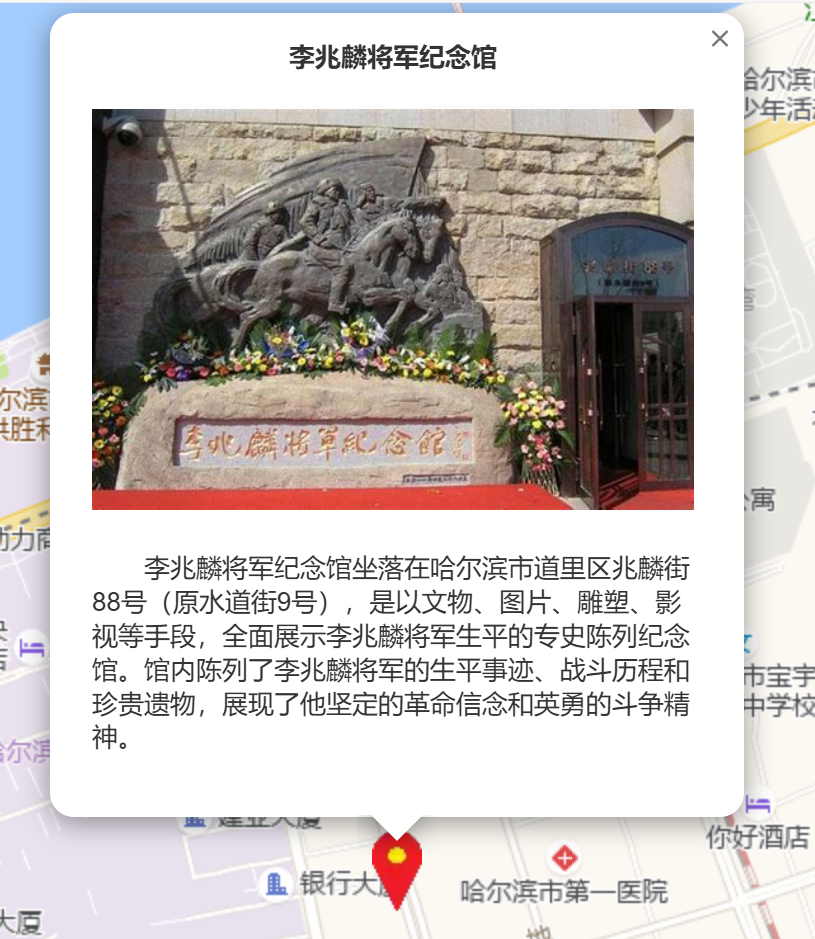

### 项目介绍

“赤色图迹”红色景点地图是为了记录 2025 年寒假，仪光赤心实践队在哈尔滨与沈阳，两大红色文化底蕴浓厚的城市中，参观过的红色景点而制作的项目。

本项目基于 [Leaflet](https://leafletjs.cn/) 开源轻量地图库开发，地图数据来自[高德地图](https://www.amap.com/)。

本地图的功能有：

- 缩放、拖动、浏览地图
- 点击侧边栏以显示全部红色景点，点击对应景点信息以传送到该景点
- 点击红色景点图标以浏览该景点的介绍
- 在 PC 端显示鼠标所指位置的经纬度
- 在地图上显示你的位置，并找到距离你最近的两个红色景点（需要定位权限）

### 使用指南

点击[这里](https://cwz2024.github.io/Harbin-project-2025/)进入地图网页

点击右下角 `+` 键以放大地图

点击右下角 `-` 键以缩小地图

点击右下角“标靶”键以定位到你的位置。

您也可以在 PC 端使用鼠标滚轮缩放，在移动端使用双指缩放。

点击左上角 `☰` 键以打开或关闭侧边栏。

侧边栏和左下部分的金色文字都是可以点击的哦，试试效果吧！

</img>

点击红色景点图标以浏览该景点的介绍。

</img>

### 技术细节

[本项目](https://github.com/cwz2024/Harbin-project-2025)是一个纯前端的项目，没有后端。

[本项目](https://github.com/cwz2024/Harbin-project-2025)有关地图的绝大多数操作都是基于 [Leaflet](https://leafletjs.cn/) 开源轻量地图库开发。

高德地图在 Leaflet 中产生的坐标偏移通过[这篇博客](https://www.cnblogs.com/s0611163/p/15606460.html)提供的代码进行纠正。
